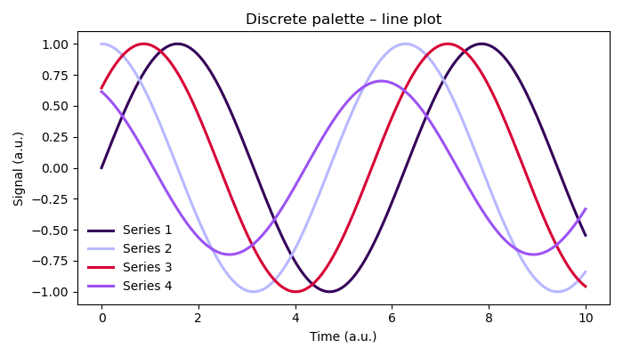
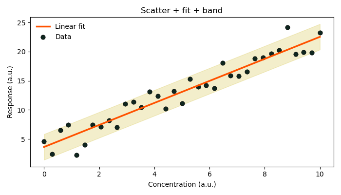
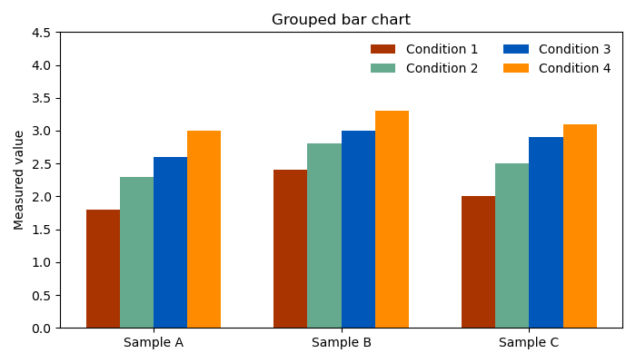
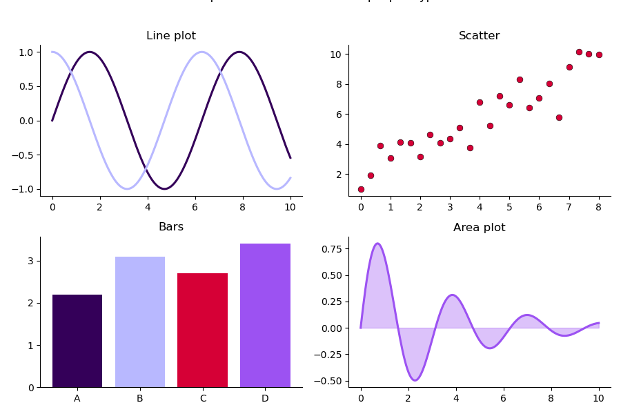
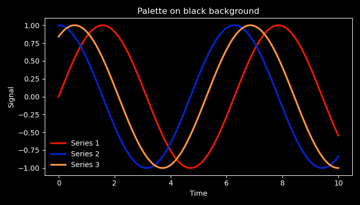
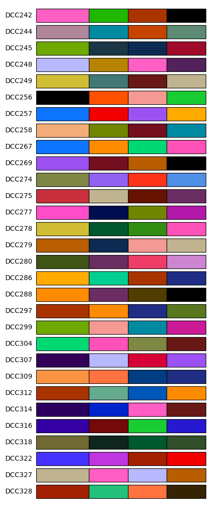

# Color Palettes for Scientific Plotting

> Generate visually balanced and pleasant color palettes for scientific plots, ready for Matplotlib.

A small Python utility for selecting color palettes for scientific plots and presentations. 

The tool extracts palettes from curated color collections and returns colors ready for use in plotting libraries such as Matplotlib.

It supports:

- discrete palettes for categorical plots
- continuous palettes generated by interpolation
- automatic palette selection
- background contrast filtering
- print-safe CMYK palettes

The goal is to make it easier to produce clear, aesthetically balanced scientific figures without manually choosing colors.

---

## Features

### Palette database
Palettes are stored in a structured dictionary containing:

- RGB values (for screen)
- CMYK values (for print)
- optional role definitions (dominant, secondary, accent)

Example:

```python
{
    "PP034": {
        "colors": {
            "c1": {"rgb": (45,72,115), "cmyk": (61,37,0,55)},
            "c2": {"rgb": (210,150,40), "cmyk": (0,29,81,18)},
        },
        "roles": {
            "dominant": "c1",
            "secondary": ["c2"]
        }
    }
}
```

Palettes can be explored using the `show_palettes` function.

Example:

```python
show_palettes(
    palettes,
    size = 2,
    mode = "s",
    background="white")
```

### Automatic palette selection

A palette can be selected randomly while ensuring it satisfies:

- minimum number of colors
- background contrast requirements

Example:

```python
colors, palette_id = get_palette(
    palettes,
    size=3,
    palette_id="r",
    mode="s"
)
```

### Continuous palettes

When more colors are requested than exist in the palette, the tool interpolates between anchor colors in perceptual color space. Ideal for plotting data series.

Example:

```python
colors, palette_id = get_palette(
    palettes,
    size=3,
    n_out=20,
    palette_id="r"
)
```

### Background-aware contrast

Palettes are filtered to ensure sufficient contrast with the chosen background.

Example:

```python
colors, palette_id = get_palette(
    palettes,
    size=3,
    background="black"
)
```

### Print mode (CMYK)

Palettes can also be returned in CMYK format for print design.

Example:

```python
colors, palette_id = get_palette(
    palettes,
    size=3,
    mode="p"
)
```

## Example outputs:

### Discrete line plot



### Continuous palette


### Scatter + regression



### Grouped bar chart



### Multi panel chart



### Black background



### Palette gallery



## Basic usage

```python
from colors_source import palettes
from colors_engine import get_palette, show_palettes

colors, palette_id = get_palette(
    palettes,
    size=3,
    n_out=12,
    palette_id="r",
    mode="s"
)

print("Palette used:", palette_id)
```

Returned colors are normalized RGB tuples ready for Matplotlib.

## Project structure

```
project/
    colors_source.py
    colors_engine.py
    plot_examples.py
    figures/
    README.md
```
	
## Limitations

- continuous interpolation checks contrast only for anchor colors
- CMYK palettes currently support only discrete output
- palette database is currently limited to curated sets

## Motivation

Choosing colors for scientific figures is often ad-hoc and inconsistent.
This project provides a simple way to generate balanced and aesthetically pleasant palettes while preserving readability, contrast, and print compatibility.

## Future improvements

- pairwise contrast checking
- larger palette database